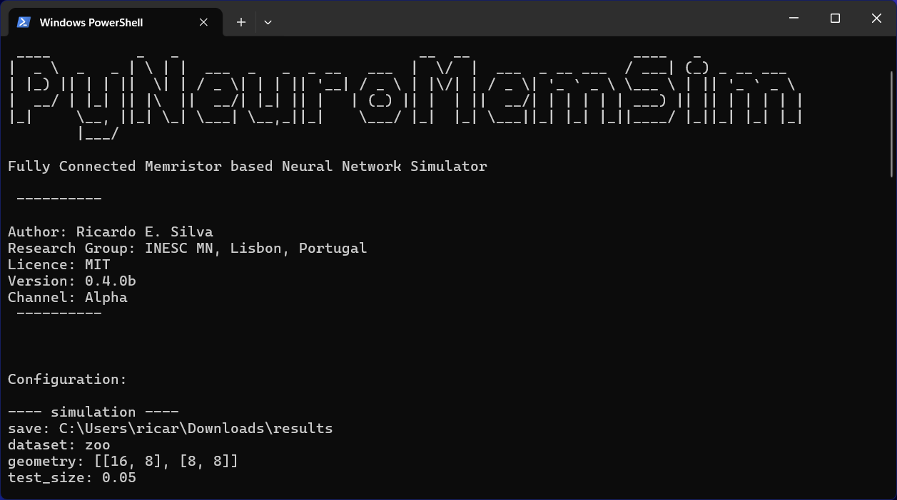

<a name="readme-top"></a>

[![Contributors][contributors-shield]][contributors-url]
[![Forks][forks-shield]][forks-url]
[![Stargazers][stars-shield]][stars-url]
[![Issues][issues-shield]][issues-url]
[![MIT License][license-shield]][license-url]
[![LinkedIn][linkedin-shield]][linkedin-url]


<!-- PROJECT LOGO -->
<br />
<div align="center">
  <a href="https://github.com/ricardoedgarsilva/PyNeuroMemSim">
    
  </a>

  <h1 align="center">PyNeuroMemSim</h1>

  <p align="center">
    Fully Connected Memristor based Neural Network Simulator
    <br />
    <a href="insert link"><strong>Explore the docs »</strong></a>
    <br />
    <br />
    ·
    <a href="">Read Paper</a>
    ·
    <a href="https://github.com/ricardoedgarsilva/PyNeuroMemSim/issues/new/choose">Report Bug</a>
    ·
  </p>
</div>


<!-- TABLE OF CONTENTS -->
<details>
  <summary>Table of Contents</summary>
  <ol>
    <li>
      <a href="#about-the-project">About The Project</a>
      <ul>
        <li><a href="#built-with">Built With</a></li>
      </ul>
    </li>
    <li>
      <a href="#getting-started">Getting Started</a>
      <ul>
        <li><a href="#prerequisites">Prerequisites</a></li>
        <li><a href="#installation">Installation</a></li>
      </ul>
    </li>
    <li><a href="#usage">Usage</a></li>
    <li><a href="#contributing">Contributing</a></li>
    <li><a href="#license">License</a></li>
    <li><a href="#contact">Contact</a></li>
    <li><a href="#acknowledgments">Acknowledgments</a></li>
  </ol>
</details>


<!-- ABOUT THE PROJECT -->
## About The Project

PyNeuroMemSim is an innovative simulation framework integrating the electronic circuit simulation capabilities of LT-Spice with Python's flexible programming environment. This project aims to enhance neuromorphic computing by simulating fully connected neural networks utilizing memristive devices.

Features
* **Hybrid Simulation Framework:** Combines LT-Spice's detailed electronic properties modeling with Python’s data processing and analysis capabilities.
* **Automated Simulations:** Facilitates the generation of LT-Spice netlists, simulation execution, and output analysis using Python.
* **Learning and Adaptation:** Incorporates backpropagation algorithms to adjust neural network weights dynamically, optimizing for performance in real-time circuit conditions.


### Research Impact 

This project addresses the lack of comprehensive tools for simulating memristor-based neural networks, contributing significantly to the field of neuromorphic computing. By enabling detailed behavior analysis and performance optimization of neural networks, this framework supports advanced computational methodologies that mimic human brain processes, offering improvements in energy efficiency and processing capabilities compared to traditional architectures.

Paper on the works!


<p align="right">(<a href="#readme-top">back to top</a>)</p>


### Built With

This section should list any major frameworks/libraries used to bootstrap your project. Leave any add-ons/plugins for the acknowledgements section. Here are a few examples.

* [![Python][Python.org]][Python-url]
* [![Anaconda][Anaconda]][Anaconda-url]
* [![LT-Spice][LT-Spice]][LT-Spice-url]


<p align="right">(<a href="#readme-top">back to top</a>)</p>


<!-- GETTING STARTED -->
## Getting Started


This is an example of how to list things you need to use the software and how to install them.

### Prerequisites

#### LT-Spice
* Download and install LT-Spice from [here](https://www.analog.com/en/design-center/design-tools-and-calculators/ltspice-simulator.html)


#### Python/Anaconda

Python is a versatile programming language that is widely used in scientific computing, data analysis, and machine learning. Anaconda is a popular distribution of Python that includes many useful libraries and tools for data science and machine learning. Although this project can be run with a standard Python installation, we recommend using Anaconda to ensure compatibility with the required dependencies.

* Download and install Anaconda from [here](https://www.anaconda.com/products/distribution) (**recommended**)

* Download and install Python from [here](https://www.python.org/downloads/) (version 3.11 or higher)


### Installation

1. Clone the PyNeuroMemSim repository
   ```sh
   git clone https://github.com/ricardoedgarsilva/PyNeuroMemSim.git
    ```

2. Install the conda environment
   ```sh
   conda env create -f environment.yml
   ```

   If you are using a standard Python installation, you can install the required packages using pip
   ```sh
    pip install ltspice pickle numpy pandas scikit-learn matplotlib art ucimlrepo keras 
    ```


3. Add ltspice.exe to the PATH environment variable, consult the LT-Spice installation directory for the location of the executable.


<p align="right">(<a href="#readme-top">back to top</a>)</p>


<!-- USAGE EXAMPLES -->
## Usage

Use this space to show useful examples of how a project can be used. Additional screenshots, code examples and demos work well in this space. You may also link to more resources.

_For more examples, please refer to the [Documentation](https://example.com)_

1. Activate the conda environment
    ```sh
    conda activate PyNeuroMemSim
    ```
    
    If you are using a standard Python installation, you can activate the environment using the following command
    ```sh
    source activate PyNeuroMemSim
    ```

2. Edit the config.py simulation parameters

2. Run the main script
    ```sh
    python main.py
    ```

<p align="right">(<a href="#readme-top">back to top</a>)</p>


<!-- CONTRIBUTING -->
## Contributing

Contributions are what make the open source community such an amazing place to learn, inspire, and create. Any contributions you make are **greatly appreciated**.

If you have a suggestion that would make this better, please fork the repo and create a pull request. You can also simply open an issue with the tag "enhancement".
Don't forget to give the project a star! Thanks again!

1. Fork the Project
2. Create your Feature Branch (`git checkout -b feature/AmazingFeature`)
3. Commit your Changes (`git commit -m 'Add some AmazingFeature'`)
4. Push to the Branch (`git push origin feature/AmazingFeature`)
5. Open a Pull Request

<p align="right">(<a href="#readme-top">back to top</a>)</p>


<!-- LICENSE -->
## License

Distributed under the MIT License. See `LICENSE` for more information.

<p align="right">(<a href="#readme-top">back to top</a>)</p>


<!-- CONTACT -->
## Contact

Ricardo E. Silva - ricardoedgarsilva@tecnico.ulisboa.pt 

Project Link: [https://github.com/ricardoedgarsilva/PyNeuroMemSim](https://github.com/ricardoedgarsilva/PyNeuroMemSim)

<p align="right">(<a href="#readme-top">back to top</a>)</p>


<!-- ACKNOWLEDGMENTS -->
## Acknowledgments

This work was made possible through the integral support
and funding provided by the Foundation for Science and
Technology, under the of the Mnemonics project.

* [Choose an Open Source License](https://choosealicense.com)
* [GitHub Emoji Cheat Sheet](https://www.webpagefx.com/tools/emoji-cheat-sheet)
* [Malven's Flexbox Cheatsheet](https://flexbox.malven.co/)
* [Malven's Grid Cheatsheet](https://grid.malven.co/)
* [Img Shields](https://shields.io)
* [GitHub Pages](https://pages.github.com)
* [Font Awesome](https://fontawesome.com)
* [React Icons](https://react-icons.github.io/react-icons/search)

<p align="right">(<a href="#readme-top">back to top</a>)</p>


<!-- MARKDOWN LINKS & IMAGES -->
<!-- https://www.markdownguide.org/basic-syntax/#reference-style-links -->
[contributors-shield]: https://img.shields.io/github/contributors/ricardoedgarsilva/pyneuromemsim.svg?style=for-the-badge
[contributors-url]: https://github.com/ricardoedgarsilva/pyneuromemsim/graphs/contributors
[forks-shield]: https://img.shields.io/github/forks/ricardoedgarsilva/pyneuromemsim.svg?style=for-the-badge
[forks-url]: https://github.com/ricardoedgarsilva/pyneuromemsim/network/members
[stars-shield]: https://img.shields.io/github/stars/ricardoedgarsilva/pyneuromemsim.svg?style=for-the-badge
[stars-url]: https://github.com/ricardoedgarsilva/pyneuromemsim/stargazers
[issues-shield]: https://img.shields.io/github/issues/ricardoedgarsilva/pyneuromemsim.svg?style=for-the-badge
[issues-url]: https://github.com/ricardoedgarsilva/pyneuromemsim/issues
[license-shield]: https://img.shields.io/github/license/ricardoedgarsilva/pyneuromemsim.svg?style=for-the-badge
[license-url]: https://github.com/ricardoedgarsilva/pyneuromemsim/blob/master/LICENSE.txt
[linkedin-shield]: https://img.shields.io/badge/-LinkedIn-black.svg?style=for-the-badge&logo=linkedin&colorB=555
[linkedin-url]: https://www.linkedin.com/in/ricardoedgarsilva/
[product-screenshot]: images/screenshot.png

[Python.org]: https://img.shields.io/badge/Python-3776AB?style=for-the-badge&logo=python&logoColor=white
[Python-url]: https://www.python.org/
[Anaconda]: https://img.shields.io/badge/Anaconda-44A833?style=for-the-badge&logo=anaconda&logoColor=white
[Anaconda-url]: https://www.anaconda.com/
[LT-Spice]: https://img.shields.io/badge/LT-Spice-000000?style=for-the-badge&logo=ltspice&logoColor=white
[LT-Spice-url]: https://www.analog.com/en/design-center/design-tools-and-calculators/ltspice-simulator.html
